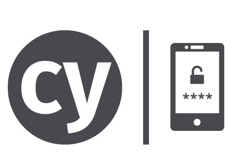

# Cypress OTP

Enter a valid OTP token in your UI tests

[](https://travis-ci.com/NoriSte/cypress-otp)
[](https://travis-ci.com/NoriSte/cypress-otp)
[](https://renovatebot.com/)
[](http://commitizen.github.io/cz-cli/)
[](https://github.com/ellerbrock/open-source-badge/) 



Use this plugin to insert a valid OTP token in a [Cypress](https://www.cypress.io) test.

# Installation

```bash
npm i -D cypress-otp
# or
yarn add -D cypress-otp
```

then open your `cypress/plugins/index.js` file and register a new task

```javascript
module.exports = on => {
  on("task", {
    generateOTP: require("cypress-otp")
  });
};
```

# How to use it

To get an OTP code

```javascript
cy.task("generateOTP", "YOUR_SECRET").then(token => {
  cy.get("#otp-token").type(token);
});
```

Take a look at the [example test](cypress/integration/cypress-otp.test.js) source code.

# Tips

- the plugin saves the last used secret so you can avoid to pass it every time. You can even set it at the beginning of your test suite

```javascript
before(() => {
  cy.task("generateOTP", "YOUR_SECRET");
});
```

and then consume the `generateOTP` task

```javascript
cy.task("generateOTP").then(token => {
  cy.get("#otp-token").type(token);
});
```

## Contributors

Thanks goes to these wonderful people ([emoji key](https://allcontributors.org/docs/en/emoji-key)):

<!-- ALL-CONTRIBUTORS-LIST:START - Do not remove or modify this section -->
<!-- prettier-ignore -->
<table><tr><td align="center"><a href="https://twitter.com/NoriSte"><br /><sub><b>Stefano Magni</b></sub></a><br /><a href="https://github.com/NoriSte/cypress-otp/commits?author=NoriSte" title="Code">💻</a> <a href="https://github.com/NoriSte/cypress-otp/commits?author=NoriSte" title="Tests">⚠️</a></td></tr></table>

<!-- ALL-CONTRIBUTORS-LIST:END -->

This project follows the [all-contributors](https://github.com/all-contributors/all-contributors) specification. Contributions of any kind welcome!
